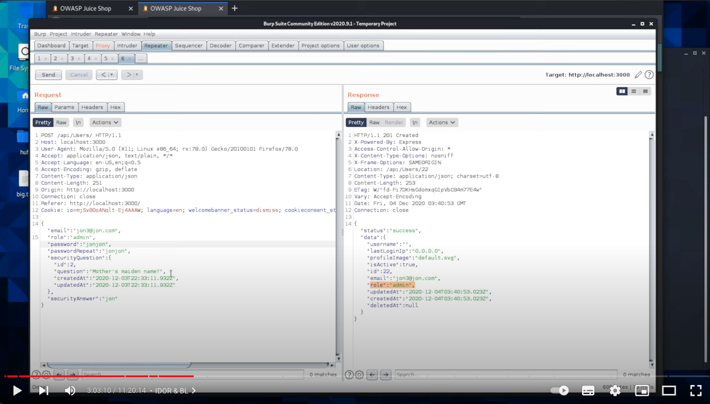

# TIL-day3-IDOR

### IDOR & BL

IDOR(Insecure Direct Object Reference): 직역하면 안전하지 않은 직접 객체 참조이며 **부적절한 인가**라고 표현한다.

- OWASP(Open Web Application Security Project, 소프트웨어 보안 발전을 위해 노력하는 비영리 단체)에서 3~4년 주기로 발표하는 웹 취약점 TOP 10의 1위인 **Broken Access Control**과 연관이 있다.
- 서버에서 수행해야할 권한 검증 및 접근 제어를 클라이언트에서 수행하는 경우가 잦아지면서 많이 발견되는 추세이다.
- 수평적/수직적 권한 상승이 발생하며, 이를 통해 타 사용자 정보에 접근해 유출하거나 기존 권한으로는 사용이 불가능한 기능을 이용하는 문제가 생긴다. 수평적 권한 상승의 경우 동일한 권한을 가진 다른 사용자의 객체에 접근할 수 있을 때를 말한다. 수직적 권한 상승의 경우 지닌 권한을 넘어서는 기능을 수행할 수 있을 때를 말한다.
- 가장 많은 양의 버그를 차지한다.

가능한 것 

1. skip login page
2. 다른 사람 계정에 들어가지
3. 다른 사람 피드에 글 쓰기
4. 마치 다른 사람인 것처럼 기록 남기기

방법

- 계정이 두 개 필요하다 그래야지 test할 수 있다. 그래야 버그를 확인할 수 있다.
- Admin 전용 hidden field 찾기. <input type = “hidden” name=”admin” value = “no”> 내 계정을 Admin으로 바꾸기.
- 쿠키내에 Userid 를 바꿔서 접근이 가능한지 확인한다.
- 쿠키를 복사하고 나갔다 들어와서 붙여넣기 했을 때 확인하기.
- 대부분 burp를 통해서 한다.

권한 확장

## URL

- [www.example.com/changepassword=username](http://www.example.com/changepassword=username)&password=password
    - 여기서 다른 id를 넣을 수도 있고 다른 id를 지우기만 할 수도 있고
    - 실제 값이 인코딩되어 있어도 data 유출이어서 취약점이다